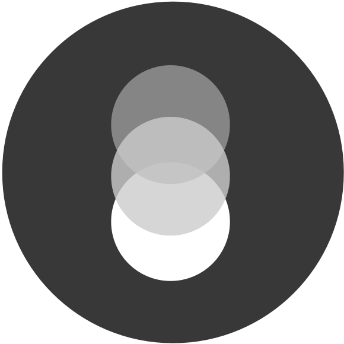

# YAH Brand

Yet another brand in Yet Another Hole.

## Naming
 - General Name: Yet Another Hole
 - Short Name: YAH

## Profile

#### What is YAH?
 - Description: An indie boring studio focus on creating holes.
 - Founded: 2018-01-08
 - Website: www.yetanotherhole.com

#### What's in the holes?
 - Yet nothing inside~

#### How to get in touch?
 - Email: hi@yetanotherhole.com

## Designing

#### Philosophy
 - Less is More;
 - Content over Form;
 - No UI is the Best UI.

#### Logo (@TODO: Abstract -> Concrete)

- Design Source: [YAH-Brand.sketch](assets/YAH-Brand.sketch)
- Design Bundle: [Press-Kit.zip](assets/Press-Kit.zip)

#### Color
 - Primary Colors: [Neutrals](https://coolors.co/383838-808080-a6a6a6-bdbdbd-f7f7f7), [Orange Gray / #e3e1dc](http://www.colorhexa.com/e3e1dc)
 - Brand Color: [Vivid Pink / #e6195d](http://www.colorhexa.com/e6195d)

#### Font
Due to the consistent typeface that file size of Chinese serif pack is huge, we only use the safe fonts in web context.

 - Web Font Family: Melon, PingFang SC, Microsoft Yahei
 - Docs Body Font: Serifs

## License
All assets of the collection are licensed under [CC BY-NC-SA 4.0](https://creativecommons.org/licenses/by-nc-sa/4.0/) license.
